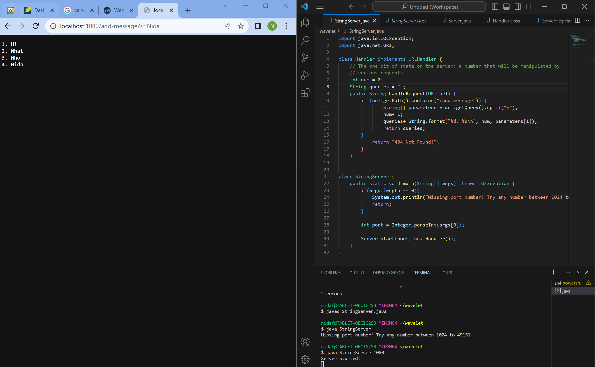
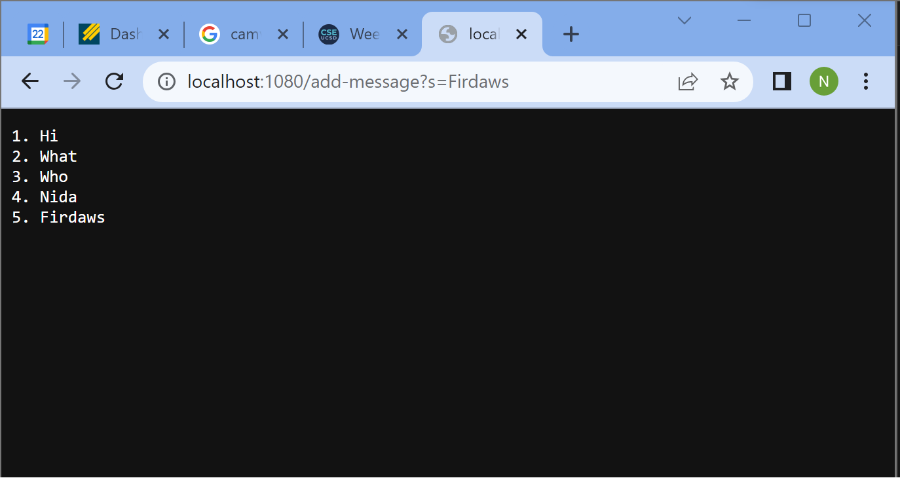
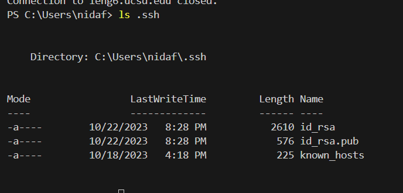
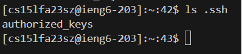
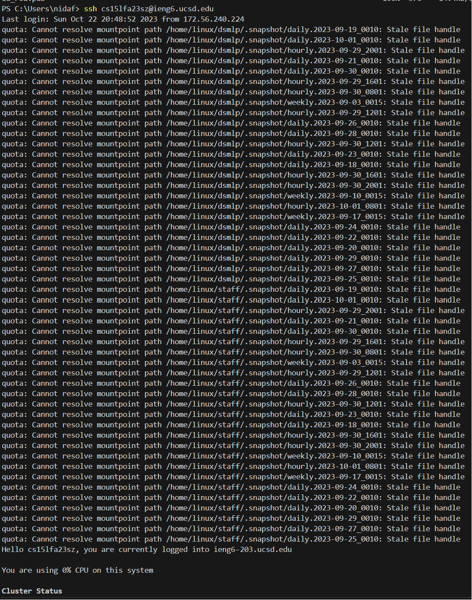

# Lab Report 2
## Part 1

The main method in StringServer.java is called, which in turn calls the start method of the Server.java file. In Server.java, the start method calls create and createContext. The handleRequest method is called when we refresh the url with the new query request. 

The main method takes in a single argument: the port number. After the port number is given it is passed into the start method with an addition Handler object. The handleRequest method takes in a URI object called url which has fields for path and query. We also have the classes ServerHttpHandler and URLHandler that have handleRequest and the handle method, which takes in HttpExhange variable. In the Handler class, we have num and queries, which keep track of the running query string to add-message and the number of times it was called. 

How do the values of any relevant fields of the class change from this specific request? If no values got changed, explain why.

No values are changed except num, queries, and the URI, as these are being updated every time we make a new query. The port remains the same because we are not changing the address, and everything else will be associated with it as long as we run the server.

For this screenshot, only handleRequest and handle are called because we already called the other methods to start the server. Now, we only have to handle alterations to the URL. 

The values for num and query have changed accordingly, but nothing else is updated.

##Part 2

##Part 3

I learned how to set up a remote server in Week 2. I also learned about different parts of a URL and what they mean when they are changed or altered. I learned how to set up a VSCode terminal using git as well. 

