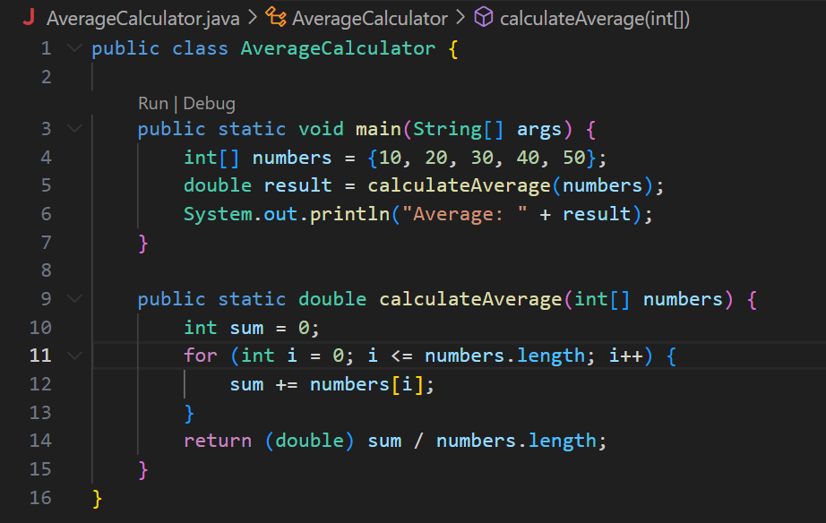
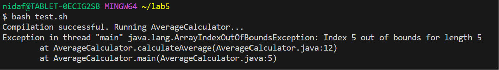
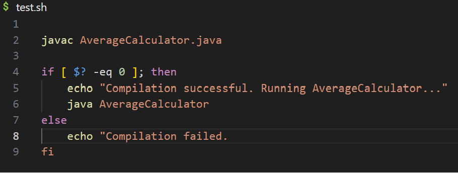
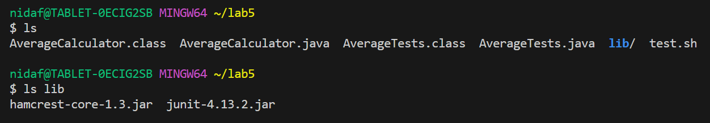
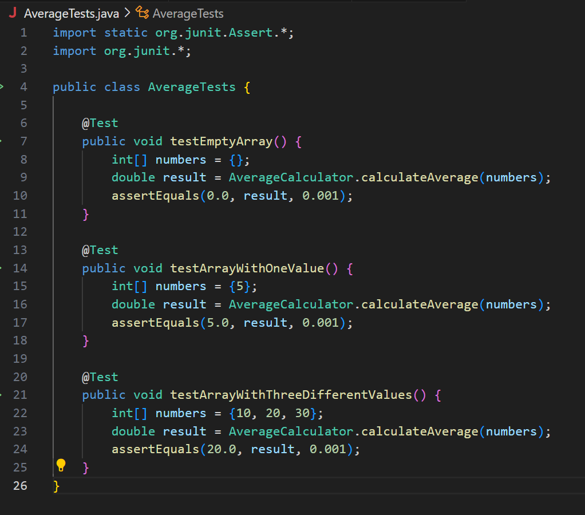
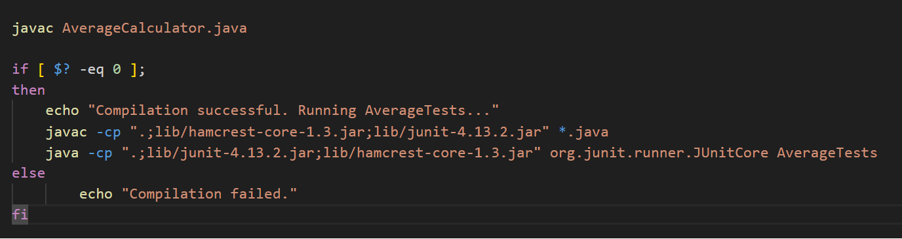
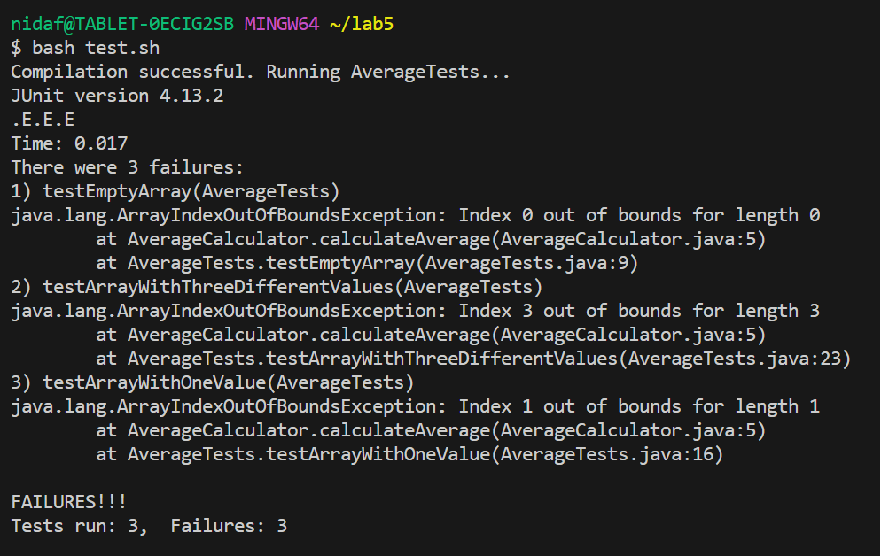
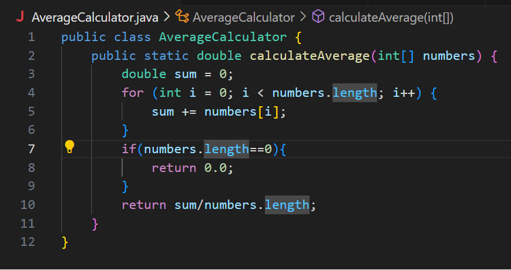
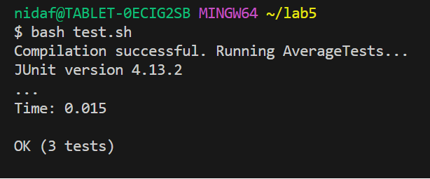

## Lab Report 5
### Part 1
Below is a simulated conversation with a student and TA.
## Issue with AverageCalculator.java
### _posted by Anonymous_
I wrote a function to calculate the average of any integer array of numbers. The function is located inside of my file called ``AverageCalculator.java``. Here is a screenshot of the code and the code for the class below: 

```
public class AverageCalculator {

    public static void main(String[] args) {
        int[] numbers = {10, 20, 30, 40, 50};
        double result = calculateAverage(numbers);
        System.out.println("Average: " + result);
    }

    public static double calculateAverage(int[] numbers) {
        int sum = 0;
        for (int i = 0; i <= numbers.length; i++) {  
            sum += numbers[i];
        }
        return (double) sum / numbers.length;
    }
}
```
  Every time I run the file using my bash script, it tells me the compilation was successful, but there's an 
  ArrayOutOfBounds error that I get when I run it. I tried running it with several different arrays, but it keeps 
  giving me the same exception. I noticed that each time I try a different array, it gives me the same out of 
  bounds error with the length of the array as out of bounds. 


```
nidaf@TABLET-0ECIG2SB MINGW64 ~/lab5
$ bash test.sh
Compilation successful. Running AverageCalculator...
Exception in thread "main" java.lang.ArrayIndexOutOfBoundsException: Index 5 out of bounds for length 5
        at AverageCalculator.calculateAverage(AverageCalculator.java:12)
        at AverageCalculator.main(AverageCalculator.java:5)
```
I tried checking line 5, but I'm not sure where to look to fix the bug. Could you help me out? 
<br>
## Reply to: Anonymous 
### _posted by: TA Ben Programmer_
Hello! I see you're having an issue with your ```AverageCalculator.java``` class. The failure inducing input 
here seems to be the array you pass into your ```main``` method in the ```.java``` file. I can't see what's 
happening in your bash script, could you explain what you need the bash script to do and what code iscurrently 
present there? 

## Reply to: Ben Programmer
### _posted by Anonymous_

My bash script is supposed to compile and run the ```AverageCalculator.java``` file. It currently looks like this:

```

javac AverageCalculator.java

if [ $? -eq 0 ]; then
    echo "Compilation successful. Running AverageCalculator..."
    java AverageCalculator
else
    echo "Compilation failed. 
fi
```
The script successfully compiles the file, but it prints out the error message right afterward. I think that means my program is correct? 

## Reply to: Anonymous
### _posted by: TA Ben Programmer_

Okay! Looking at the code, can see that your bash script is meant to compile the file, then run it if compilation is successful. If compilation is 
successful, it means that the compiler successfully found the file and was able to understand the code. The ```ArrayIndexOutOfBoundsException```
below  ```'Compilation successful``` shows that there is a bug within your program itself, given that it took in input from your main method. 
I am going to make the following suggestions: 

- Try creating a separate file to run your tests as JUnit. This will allow you to add in tests without having to rewrite the entire process in the main method.
- Check that your code is running as expected, walk through the array inside the loop (create a table, and write down the values of the local variables as you go), to make sure that your loop conditions and inner loop actions get you to the desired output: the average.

I hope this helps!

## Reply to: Ben Programmer
### _posted by Anonymous_

Okay! I tried creating a separate JUnit file to run my tests on three different arrays: one that is empty (which should return 0.0), an array with just one value, and an array with 3 different values. I created a separate file within the same directory called ```lib```, and then I put in the two files we used for a previous project for the JUnit imports. My directory now looks like this: 

```
nidaf@TABLET-0ECIG2SB MINGW64 ~/lab5
$ ls
AverageCalculator.class  AverageCalculator.java  AverageTests.class  AverageTests.java  lib/  test.sh

nidaf@TABLET-0ECIG2SB MINGW64 ~/lab5
$ ls lib
hamcrest-core-1.3.jar  junit-4.13.2.jar
```
I removed the main method from ```AverageCalculator.java``` and created a new file called ```AverageTests.java```. There, I imported the necessary tools for JUnit and created the three tests with the following format:

```
import static org.junit.Assert.*;
import org.junit.*;

public class AverageTests {

    @Test
    public void testEmptyArray() {
        int[] numbers = {};
        double result = AverageCalculator.calculateAverage(numbers);
        assertEquals(0.0, result, 0.001);  
    }

    @Test
    public void testArrayWithOneValue() {
        int[] numbers = {5};
        double result = AverageCalculator.calculateAverage(numbers);
        assertEquals(5.0, result, 0.001);
    }

    @Test
    public void testArrayWithThreeDifferentValues() {
        int[] numbers = {10, 20, 30};
        double result = AverageCalculator.calculateAverage(numbers);
        assertEquals(20.0, result, 0.001);
    }
}
```
I then edited my ```tests.sh``` bash file to compile and run the JUnit files to test the method. I removed the commands to run the ```AverageCalculator.java``` and then replaced them with the JUnit commands for Windows users, since I am on Windows. 

```
javac AverageCalculator.java

if [ $? -eq 0 ]; 
then
    echo "Compilation successful. Running AverageTests..."
    javac -cp ".;lib/hamcrest-core-1.3.jar;lib/junit-4.13.2.jar" *.java
    java -cp ".;lib/junit-4.13.2.jar;lib/hamcrest-core-1.3.jar" org.junit.runner.JUnitCore AverageTests
else
        echo "Compilation failed."
fi
```
Then I saved everything and ran it again, and this was my error message: 

```
nidaf@TABLET-0ECIG2SB MINGW64 ~/lab5
$ bash test.sh
Compilation successful. Running AverageTests...
JUnit version 4.13.2
.E.E.E
Time: 0.015
There were 3 failures:
1) testEmptyArray(AverageTests)
java.lang.AssertionError: expected:<0.0> but was:<NaN>
        at org.junit.Assert.fail(Assert.java:89)
        at org.junit.Assert.failNotEquals(Assert.java:835)
        at org.junit.Assert.assertEquals(Assert.java:555)
        at org.junit.Assert.assertEquals(Assert.java:685)
        at AverageTests.testEmptyArray(AverageTests.java:10)
2) testArrayWithThreeDifferentValues(AverageTests)
java.lang.AssertionError: expected:<20.0> but was:<0.0>
        at org.junit.Assert.fail(Assert.java:89)
        at org.junit.Assert.failNotEquals(Assert.java:835)
        at org.junit.Assert.assertEquals(Assert.java:555)
        at org.junit.Assert.assertEquals(Assert.java:685)
        at AverageTests.testArrayWithThreeDifferentValues(AverageTests.java:24)
3) testArrayWithOneValue(AverageTests)
java.lang.AssertionError: expected:<5.0> but was:<0.0>
        at org.junit.Assert.fail(Assert.java:89)
        at org.junit.Assert.failNotEquals(Assert.java:835)
        at org.junit.Assert.assertEquals(Assert.java:555)
        at org.junit.Assert.assertEquals(Assert.java:685)
        at AverageTests.testArrayWithOneValue(AverageTests.java:17)

FAILURES!!!
Tests run: 3,  Failures: 3
```
I can see that all three errors are very telling: they all say index out of bounds for the size of the array, meaning that at some point, we are trying to access values that aren't in the array at all. I thought this might mean that there's something wrong with my for loop. In the condition for the for loop, I wrote: 
```
for (int i = 0; i <= numbers.length; i++) 
```
The equal sign means that I always access indexes 0-length of array inclusive instead of exclusive. So, I removed the ```=``` and added an if statement to return 0.0 if the length of the array is 0. 

```
public class AverageCalculator {
    public static double calculateAverage(int[] numbers) {
        double sum = 0;
        for (int i = 0; i < numbers.length; i++) {  
            sum += numbers[i];
        }
        if(numbers.length==0){
            return 0.0;
        }
        return sum/numbers.length; 
    }
}
```
Then, I ran it again with ```tests.sh```, and success! All three tests passed. I think some 
other cases need to be covered, but for now, this works! Thanks Ben!

```
nidaf@TABLET-0ECIG2SB MINGW64 ~/lab5
$ bash test.sh
Compilation successful. Running AverageTests...
JUnit version 4.13.2
...
Time: 0.015

OK (3 tests)
```

## Reply to: Anonymous
### _posted by: TA Ben Programmer_
Great! Keep adding to that tests file. 

### Part 2
Something I learned from my lab experiences this quarter was how to effectively minimize the number of keypresses required to do basic code editing via Vim. I didn't think I would ever have to utilize Vim to do anything except to move around files, but this lab experience taught me that timesavings is actually very valuable. I also learned how to collaboratively edit code on Github, and the reasoning behind adding, committing, and pushing. The tutors were very patient and helpful along the way, I look forward to using these skills in the future!


