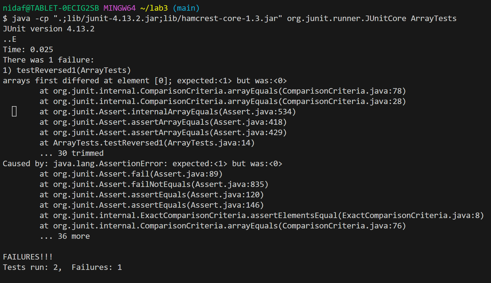

# Lab Report 3
## Part 1
From ```ArrayExamples.java``` : 
```
 static int[] reversed(int[] arr) {
    int[] newArray = new int[arr.length];
    for(int i = 0; i < arr.length; i += 1) {
      arr[i] = newArray[arr.length - i - 1];
    }
    return arr;
  }
```
Failure inducing input: 
```
@Test
  public void testReversed1(){
    int[] input = {4,3,2,1};
    ArrayExamples.reversed(input);
    assertArrayEquals(new int[]{1,2,3,4}, ArrayExamples.reversed(input));
  }
```
Non-failure inducing input: 
```
 @Test
  public void testReversed() {
    int[] input1 = { };
    assertArrayEquals(new int[]{ }, ArrayExamples.reversed(input1));
  }
```
Symptom: 


Before: 
```
  static int[] reversed(int[] arr) {
    int[] newArray = new int[arr.length];
    for(int i = 0; i < arr.length; i += 1) {
      arr[i] = newArray[arr.length - i - 1];
    }
    return arr;
  }
```
After Fix: 
```
  static int[] reversed(int[] arr) {
    int[] newArray = new int[arr.length];
    for(int i=0; i<arr.length; i+=1){
        newArray[i] = arr[arr.length-i-1];
    }
    return newArray; 
  }
```

The reversed method changes from reassigning the elements of ```arr``` using ```newArray``` to the opposite, so that ```newArray``` becomes populated with the elements of ```arr``` in reverse order. 

## Part 2
```find``` command
1. 
```
nidaf@TABLET-0ECIG2SB MINGW64 ~/docsearch (main)        
$ find technical -type d
technical
technical/911report
technical/biomed
technical/government
technical/government/About_LSC
technical/government/Alcohol_Problems
technical/government/Env_Prot_Agen
technical/government/Gen_Account_Office
technical/government/Media
technical/government/Post_Rate_Comm
technical/plos

```
This is finding all directories under a greater directory, ```technical```. It is useful because it will show us how many branches down from a main directory we can see. 
2. 
```
nidaf@TABLET-0ECIG2SB MINGW64 ~/docsearch (main)        
$ find technical/government -type d
technical/government
technical/government/About_LSC
technical/government/Alcohol_Problems
technical/government/Env_Prot_Agen
technical/government/Gen_Account_Office
technical/government/Media
technical/government/Post_Rate_Comm
```
This is showing the number of directories under one specific folder. This helps us narrow our searching if we are interested in only one folder. 
3. 

```
nidaf@TABLET-0ECIG2SB MINGW64 ~/docsearch (main)        
$ find technical/biomed -type f -name "*.txt"
technical/biomed/1468-6708-3-1.txt
technical/biomed/1468-6708-3-10.txt
technical/biomed/1468-6708-3-3.txt
technical/biomed/1468-6708-3-4.txt
technical/biomed/1468-6708-3-7.txt
technical/biomed/1471-2091-2-10.txt
technical/biomed/1471-2091-2-11.txt
technical/biomed/1471-2091-2-12.txt
technical/biomed/1471-2091-2-13.txt
technical/biomed/1471-2091-2-16.txt
.... (contd)
```
This is showing the all files of a specific type, which is useful for searching and sorting within text files only. 
4. 
```
nidaf@TABLET-0ECIG2SB MINGW64 ~/docsearch (main)
$ find technical/biomed -type f -name "*.pdf"
```
This is useful because now we can see there are no files in this giant directory that are of the type .pdf. 

5. 
```
nidaf@TABLET-0ECIG2SB MINGW64 ~/docsearch (main)
$ find technical/911report -type f -exec grep -l 'BIRD' {} \;
```
This is useful because we can try to search for paths to files that contain a specific pattern.
We
6. 
```
nidaf@TABLET-0ECIG2SB MINGW64 ~/docsearch (main)
$ find technical/biomed  -type f -exec grep -l 'bird' {} \;
technical/biomed/1471-2105-3-2.txt
technical/biomed/1471-2121-3-13.txt
technical/biomed/1471-2148-1-4.txt
technical/biomed/1471-2148-2-17.txt
technical/biomed/1471-2180-3-10.txt

```
The files containing the specific pattern (case-sensitive) are printed out onto the console. We can easily alter the directories we use this command for. 
7. 
```
nidaf@TABLET-0ECIG2SB MINGW64 ~/docsearch (main)
$ find . -type f | wc -l
1426
```
This is useful because it allows us to look at the total number of files in our directory.
8. 
```
nidaf@TABLET-0ECIG2SB MINGW64 ~/docsearch (main)
$ find technical/911report  -maxdepth 1 -type f | wc -l
17
```
This is useful because it allows us to look at the total number of files under a specific directory. 

