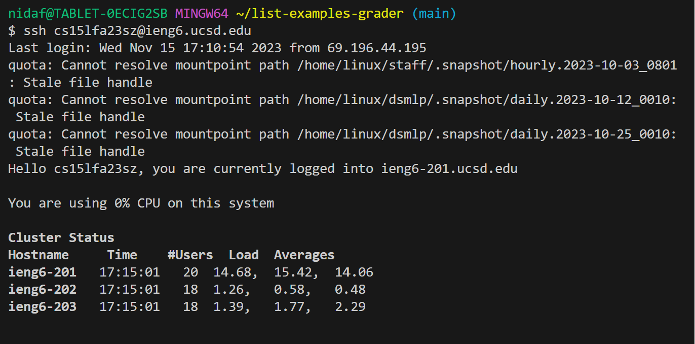
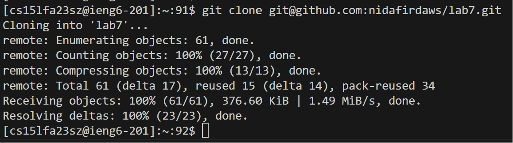
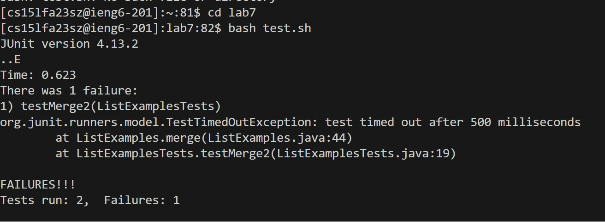
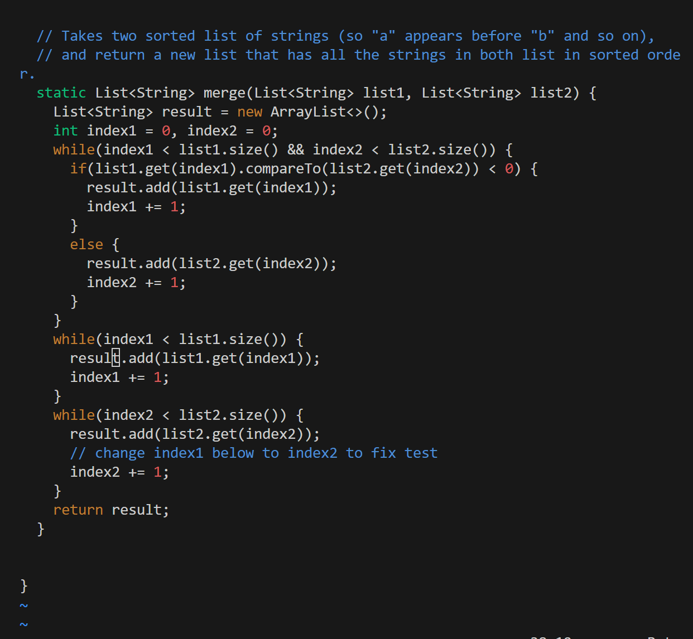
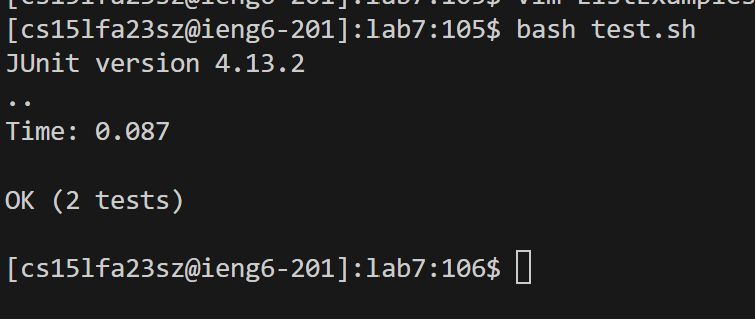
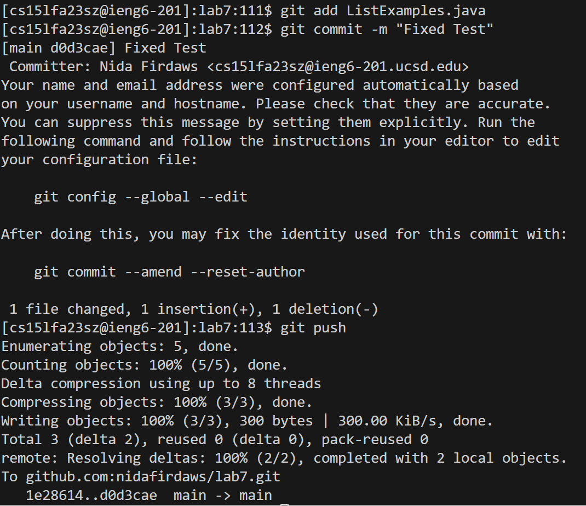

## Lab Report 4

## Task 1 - logging into ieng6

`<up>`
I pressed <up> once because the command `ssh cs15lfa23sz@ieng6.ucsd.edu` was one up in my command history. 

## Task 2 - Cloning the forked repository

`<up><up><up><up><up><up><up><up>`

I pressed <up> eight times because the command `git clone git@github.com:nidafirdaws/lab7.git` was 8 up in my command history.

## Task 3 - Running the tests

`<cd lab7><bash test.sh>`

I typed `cd lab7` to change the directory to `lab7`. Then, I typed `bash test.sh` to run the tests, demonstrating that they fail. 

## Task 4 - Fixing the vim file

`<vim ListExamples.java><?index1><l><l><l><l><l><l><i><backspace><2><ESC><:wq!>`

I typed the command `vim ListExamples.java` to open the ListExamples.java file in the vim editor, and then used `?index1` to find the last instance of `index1` in the `ListExamples.java` file. I then pressed `enter` to jump to the line, and pressed `<l>` 6 times to move to the digit 2. I then pressed `i` to enter insert mode and pressed `<backspace>` to delete the 1, typing a `2`. I then pressed `<ESC>` and typed `:wq!` to save the changes.

## Task 5 - Rerunning the tests

`bash test.sh`
I typed `bash test.sh` to run the newly saved `ListExamples.java` file using the bash script. 

## Task 6 - Committing and pushing 

`<git add ListExamples.java><git commit -m "Fixed test"><git push>`

I typed `git add ListExamples.java` to add the changes to the file, then I typed a commit message with `git commit -m "Fixed test"` to commit the changes and  pushed to the main branch of the forked repository using `git push` save the changes. 
